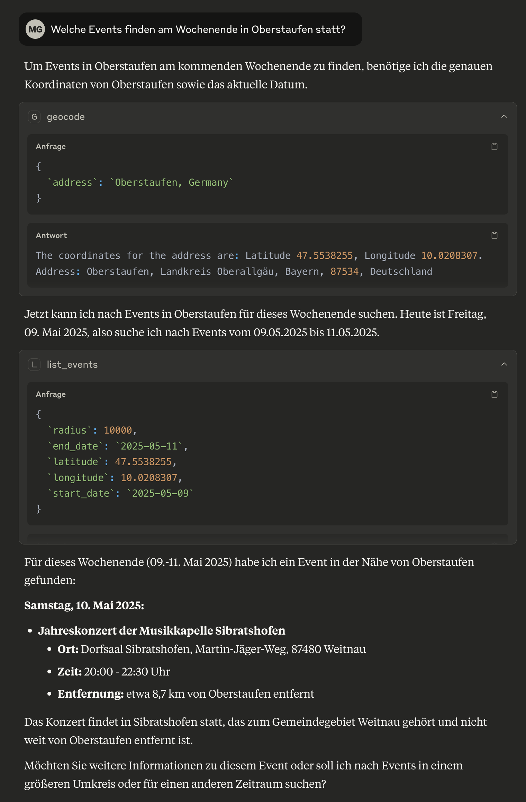
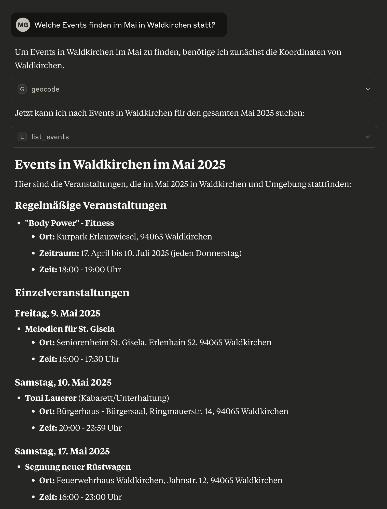

# MCP Server Project (Proof of Concept)

This repository contains two Model Context Protocol (MCP) servers that provide location-based services:

1. **Nominatim MCP Server** - Provides geocoding and location services using OpenStreetMap data
2. **BayernCloud Tourism MCP Server** - Provides access to tourism events data from the BayernCloud API

## Overview

The Model Context Protocol (MCP) enables large language models like Claude to interact with external tools and data sources. This project implements two MCP servers that can be integrated with Claude or other AI assistants to provide location-based services.

## BayernCloud Tourism MCP Server

The BayernCloud Tourism MCP server provides access to tourism event data from the Bayern Cloud Tourism API. It offers the following tools:

- **list_events** - Retrieve events near a specific location within a specified date range

### Example Integration





## Setup

### Prerequisites

- Node.js (v14 or newer)
- An API key for BayernCloud Tourism API (for the events server) get in here: https://bayerncloud.digital/

### Installation

1. Clone this repository
2. Install dependencies:
   ```
   npm install
   ```
3. Create a `.env` file in the root directory with the following variables:
   ```
   BCT_API_TOKEN=your_bayern_cloud_api_token
   NOMINATIM_BASE_URL=https://nominatim.openstreetmap.org
   OSRM_BASE_URL=http://router.project-osrm.org
   BAYERN_CLOUD_API_URL=https://data.bayerncloud.digital/api/v4/endpoints
   ```

### Integration Example

Can be used for Claude Desktop an others.

See https://modelcontextprotocol.io/quickstart/user how to include with Claude Desktop.

```json
{
  "servers": {
    "mcp-server-nominatim": {
      "type": "stdio",
      "command": "node",
      "args": [
        "/path/to/your/mcp-server/src/nominatim.js"
      ]
    },
    "mcp-events-bct": {
      "type": "stdio",
      "command": "node",
      "args": [
        "/path/to/your/mcp-server/src/bayerncloud.js"
      ]
    }
  }
}
```

This project is licensed under the MIT License.